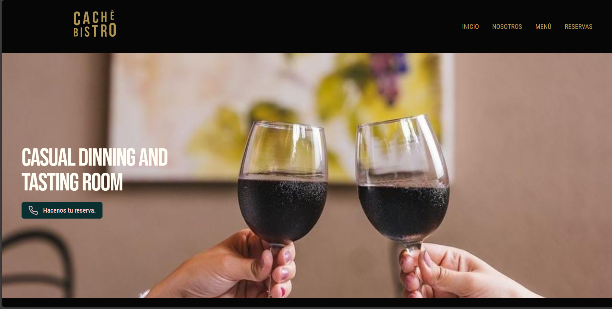

# Hola a todos, mi nombre es Franco Martínez 👋
## Desarrollador web y programador con Python

Tengo 24 años y me apasiona la programación y el desarrollo web, al cual me estoy dedicando actualmente. Soy originario de la provincia de Mendoza en Argentina, pero actualmente vivo en Málaga, España.
Me gusta aprender cada día y poder poner en práctica esos conocimientos. Mi sueño es dedicarme profesionalmente en este mundo y quizas algun día enseñar todo lo aprendido.

## Lenguajes de programación

## Frameworks y herramientas

## Portafolio

# Mis proyectos

## Caché Bistro

Reserva y conoce todo acerca del Restaurante N°1 de la Ciudad de Mendoza, Argentina -> [**Caché Bistro**](https://cache-bistro.reflex.run)

## Hermes Dev

Revisa todos los trabajos de Hermes Dev y ponte en contacto ante cualquier duda -> [**Hermes Dev**](https://hermes.reflex.run)

## Jacaranda Coffee

Página realizada con fines de aprendizaje, podes consultarla en [**Jacaranda Coffee**]( https://jacaranda-coffee.reflex.run)

# Contacto

 

## Gracias por ver este repositorio, espero tener novedades tuyas proximamente. 😊

<!--
**francomg99/francomg99** is a ✨ _special_ ✨ repository because its `README.md` (this file) appears on your GitHub profile.

Here are some ideas to get you started:

- 🔭 I’m currently working on ...
- 🌱 I’m currently learning ...
- 👯 I’m looking to collaborate on ...
- 🤔 I’m looking for help with ...
- 💬 Ask me about ...
- 📫 How to reach me: ...
- 😄 Pronouns: ...
- ⚡ Fun fact: ...
-->
